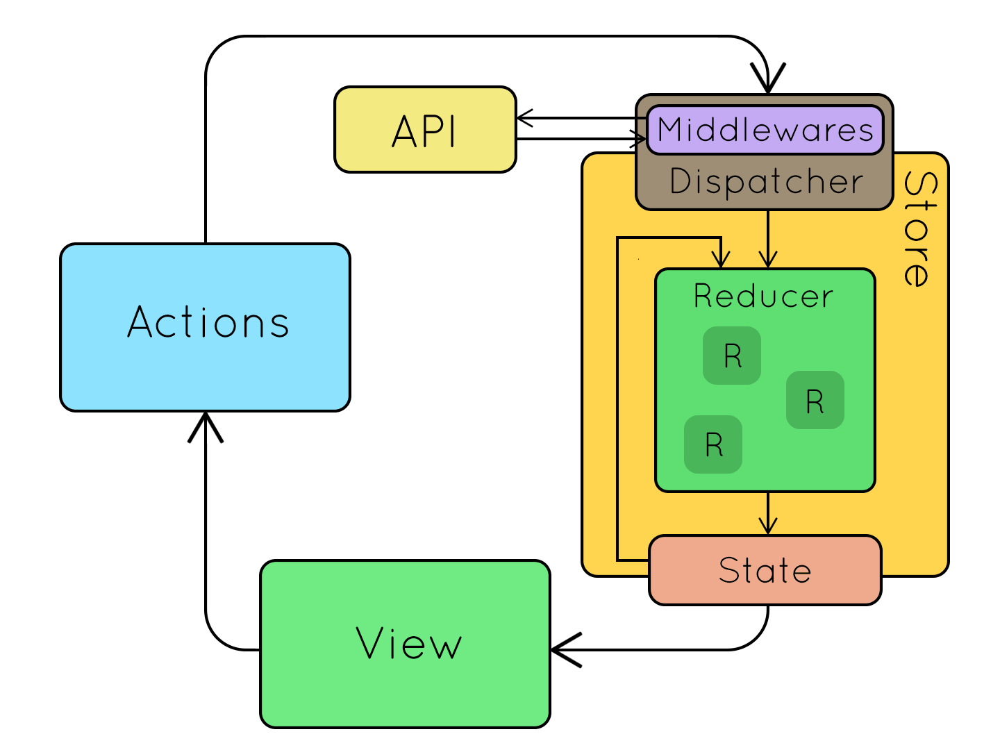

# Redux Observable

<!-- TOC -->

- [Redux Observable](#redux-observable)
    - [Nguyên tắc](#nguyên-tắc)
        - [3 nguyên tắc của Redux](#3-nguyên-tắc-của-redux)
        - [Cách thức hoạt động](#cách-thức-hoạt-động)
            - [Action:](#action)
            - [Reducers](#reducers)
            - [Store](#store)
    - [Cài đặt](#cài-đặt)
    - [Ví dụ](#ví-dụ)
        - [Mô tả thư mục](#mô-tả-thư-mục)
        - [Code](#code)
            - [Cài đặt trong App](#cài-đặt-trong-app)
            - [Cài đặt Store](#cài-đặt-store)
            - [Component Gọi Action để sử dụng](#component-gọi-action-để-sử-dụng)
            - [User Action](#user-action)
            - [Producer](#producer)
            - [Middleware - Observable: Get Data](#middleware---observable-get-data)
        - [Đơn giản hóa reducer: REQUEST, SUCCESS, FAILURE](#đơn-giản-hóa-reducer-request-success-failure)

<!-- /TOC -->

## Nguyên tắc

### 3 nguyên tắc của Redux

- Single source of truth: State của toàn bộ ứng dụng được lưu trong trong 1 store duy nhất là 1 Object mô hình tree.
- State is read-only: Chỉ có 1 cách duy nhất để thay đổi state đó là tạo ra một action (là 1 object mô tả những gì xảy ra)
- Changes are made with pure functions: Để chỉ rõ state tree được thay đổi bởi 1 action bạn phải viết pure reducers

### Cách thức hoạt động



#### Action: 

Định nghĩa Giá trị được Luân chuyển, Mô tả hành động
Mỗi action là 1 Fure Object, 2 thuộc tính:

```
{
  type: "KIEU_ACTION",
  payload: //tham số
}
```

#### Reducers

Chuyển đổi giá trị, nhận vào State cũ + Action => Trả về State mới

```
(previousState, action) => newState
```

#### Store

Lưu trữ State toàn ứng dụng

## Cài đặt

npm install --save redux
npm install --save react-redux
npm install --save redux-observable
npm install --save rxjs

## Ví dụ

### Mô tả thư mục

- App.js
- src
- - redux
- - AppStore.js
- - action.js
- - AppReducers
- Constant.js
- TestScene.js  // Component for Showing

### Code

#### Cài đặt trong App

```js
// Config trong App.js
class App extends Component {

  render() {
    return (
      <Provider store={configureStore()}>
        <TestScene />
      </Provider>
    );
  }
}
export default App;
```

#### Cài đặt Store

```js
// Tạo Store: src/redux/configureStore.js
import { createStore, applyMiddleware, compose } from 'redux'
import { createEpicMiddleware } from 'redux-observable'
import { retry } from 'rxjs/operator/retry';
import AppReducers from './AppReducers'
import fetchUserEpic from './epic'

// Kết hợp nhiều Middleware lại
const epicMiddleware = createEpicMiddleware(fetchUserEpic); // sẽ Tạo sau

const configureStore = () => {
  return createStore(
    AppReducers(),  // Sẽ tạo sau
    applyMiddleware(epicMiddleware)
    )
}
export default configureStore;
```

#### Component Gọi Action để sử dụng

```js
...
import { connect } from "react-redux";
import { bindActionCreators } from "redux";
import { getUserRequest } from "./redux/UserAction";

class TestScene extends React.Component {

    _onGetPress = () => {
        this.props.getUserRequest('luunghiatran');  // Gọi Action trong Store
    }

    render () {
        const {loading, error, data } = this.props;

        return (
            <View>
                { loading ?
                    <Text>Loading</Text> :
                    <Button title="Get" onPress={this._onGetPress}></Button>
                }
                <Text style={{color:'red'}}>{error}</Text>
                <Text>{ data ? data.avatar_url : "DATA HERE"}</Text>
            </View>
        )
    }
}

// Chuyển State Thành Props để render
const mapStateToProps = (state) => {
    return {
        loading: state.UserProducer.loading,
        error: state.UserProducer.error,
        data: state.UserProducer.data
    };
}
  
// Khai báo Action sử dụng
function dispatchToProps(dispatch) {
    return bindActionCreators({getUserRequest}, dispatch);
}

// Kết nối component và Store, kết quả trả về trong mapStateToProps
export default connect(mapStateToProps, dispatchToProps)(TestScene);
```

#### User Action

```js
// Tạo Action: Để lưu trữ giá trị luân chuyển
//src/redux/UserAction.js
import { FETCHING_USER_REQUEST, FETCHING_USER_SUCCESS, FETCHING_USER_FAILURE } from '../constants'

export const getUserRequest = (search) => ({type: FETCHING_USER_REQUEST, payload: search})
export const getUserSuccess = (data) => ({ type: FETCHING_USER_SUCCESS, payload: data })
export const getUserFailure = (error) => ({ type: FETCHING_USER_FAILURE, payload: error, error: true })


// src/Constants.js: lưu loại Action
export const FETCHING_USER_REQUEST = 'FETCHING_DATA_REQUEST';
export const FETCHING_USER_SUCCESS = 'FETCHING_DATA_SUCCESS';
export const FETCHING_USER_FAILURE = 'FETCHING_DATA_FAILURE';
```

#### Producer

```js
// Tạo Producer chuyển đổi State
// Reducer để get Data
export const UserProducer = (state = INITIAL_STATE, action) => {
    switch (action.type) {
        case FETCHING_USER_REQUEST:
            console.log("FETCHING_USER_REQUEST");
            return { ...state, loading: true  };
        case FETCHING_USER_SUCCESS:
            console.log("FETCHING_USER_SUCCESS");
            return { ...state, loading: false, data: action.payload };
        case FETCHING_USER_FAILURE:
        console.log("FETCHING_USER_FAILURE");
            return { ...state, loading: false };
        default:
            return state;
    }
};


// File: src/redux/AppReducers.js
...
import { combineReducers } from "redux";
import { FETCHING_USER_REQUEST, FETCHING_USER_SUCCESS, FETCHING_USER_FAILURE } from "../constants";

// Kết hợp nhiều reducers lại
const AppReducers = () => {
    return combineReducers({
        UserProducer,
    })
}
export default AppReducers;
```

#### Middleware - Observable: Get Data

```js
// Tạo Epic Middleware, để get Data,
// File: src/redux/epic.js
import { FETCHING_USER_REQUEST, FETCHING_USER_SUCCESS } from '../constants'
import { getUserSuccess, getUserFailure } from './actions'
import 'rxjs'
import { Observable } from 'rxjs/Observable'

const fetchUser = (userName) => {
  //https://api.github.com/users/userName
  const request = fetch(`https://api.github.com/users/${userName}` ,
  {
    method: 'GET',
    headers: "{ 'Accept': 'application/json', 'Content-Type': 'application/json' }"
  })
  .then(response => response.json());
  return request;
}

const fetchUserEpic = action$ =>
  action$
  .ofType(FETCHING_USER_REQUEST)
  .debounceTime(500) // Delay
  .switchMap(action => Observable.from(fetchUser(action.payload))
    .map(response => getUserSuccess(response))
    .catch(error => Observable.of(getUserFailure(error))
    )
  );
export default fetchUserEpic;
```


### Đơn giản hóa reducer: REQUEST, SUCCESS, FAILURE

https://medium.com/stashaway-engineering/react-redux-tips-better-way-to-handle-loading-flags-in-your-reducers-afda42a804c6


**Mục đích rút gọn UserProducer**
loại bỏ FETCHING_USER_REQUEST, FETCHING_USER_ERROR

```js
export const UserProducer = (state = INITIAL_STATE, action) => {  
    switch(action.type) {
        case FETCHING_USER_SUCCESS:
            return { ...state, data: action.payload };

        default:
            return state;
        }
};
```

Tạo loadingReducer để xử lý **loading state**, chỉ có Action "*_REQUEST" trả về {loading: true}

```js
// src/redux/api/loadingReducer.js
const loadingReducer = (state = {}, action) => {
    const { type } = action;
    const matches = /(.*)_(REQUEST|SUCCESS|FAILURE)/.exec(type);

    // not a *_REQUEST / *_SUCCESS /  *_FAILURE actions, so we ignore them
    if (!matches) return state;  
    
    const [, requestName, requestState] = matches;
    return {
      ...state,
      // Store whether a request is happening at the moment or not
      // e.g. will be true when receiving GET_TODOS_REQUEST
      //      and false when receiving GET_TODOS_SUCCESS / GET_TODOS_FAILURE
      [requestName]: requestState === 'REQUEST',
    };
};
export default loadingReducer;


// src/redux/AppReducers.js
const AppReducers = () => {
    return combineReducers({
        ...
        UserProducer,
        loading: loadingReducer,
        error: errorReducer,    //Sẽ làm sau
    })
}
```

**Tạo createLoadingSelector:** 
convert loading value trả về, hiển thị trong View

```js
// src/redux/selector.js
// Actions: Init Parameter, State: pass parameter
export const createLoadingSelector = (actions) => (state) => {
    // returns true only when all actions is not loading
    return actions.some(action => state.loading[action]);
};

// Sử dụng trong Component:
// src/TestScene.js
const loadingSelector = createLoadingSelector(['FETCHING_DATA']);
const errorSelector = createErrorMessageSelector(['FETCHING_DATA']);

const mapStateToProps = (state) => {
    var result = {
        loading: loadingSelector(state),    // Convert state thành loading
        error: errorSelector(state),        // Convert error thành error, thực hiện sau
        data: state.UserProducer.data
    };
    return result;
}
```

**Áp dụng với Error State**

```js
// src/redux/api/errorReducer.js
const errorReducer = (state = {}, action) => {
    const { type, payload } = action;
    const matches = /(.*)_(REQUEST|FAILURE)/.exec(type);
  
    // not a *_REQUEST / *_FAILURE actions, so we ignore them
    if (!matches) return state;
  
    const [, requestName, requestState] = matches;
    return {
      ...state,
      // Store errorMessage
      // e.g. stores errorMessage when receiving GET_TODOS_FAILURE
      //      else clear errorMessage when receiving GET_TODOS_REQUEST
      [requestName]: requestState === 'FAILURE' ? payload : '',
    };
  };
export default errorReducer;


// src/redux/api/selectors.js
export const createErrorMessageSelector = (actions) => (state) => {
    // returns the first error messages for actions
    // * We assume when any request fails on a page that
    //   requires multiple API calls, we shows the first error

    const errors = actions.map(action => state.error[action]);
    if (errors && errors[0]) {
        return errors[0];
    }
    return '';
  };
```
