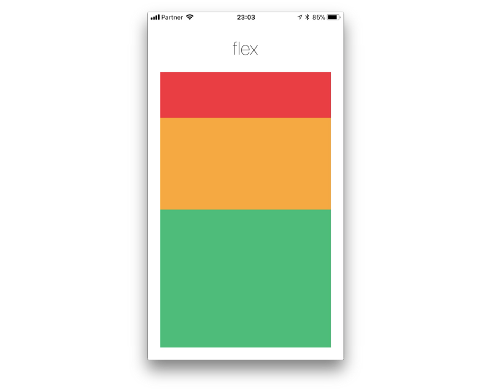
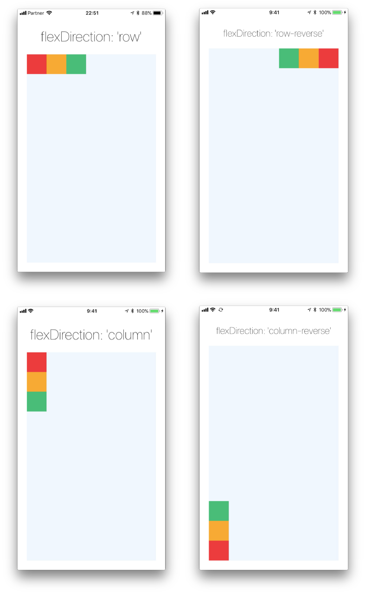
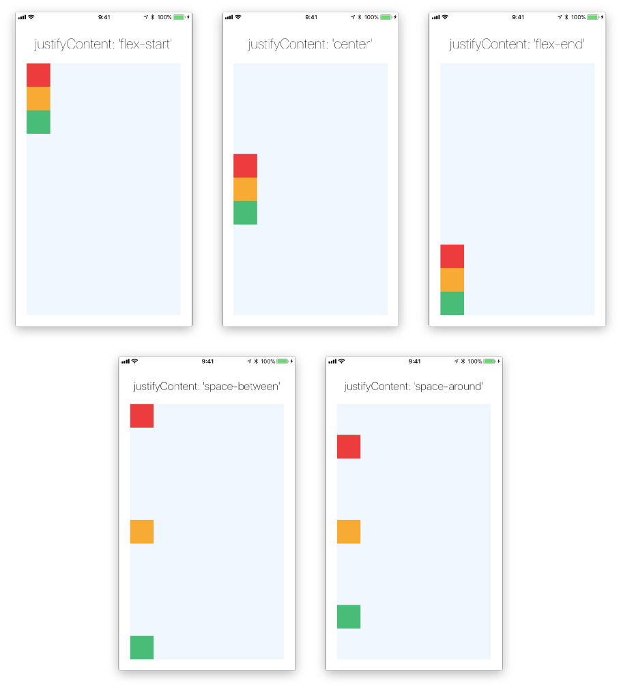
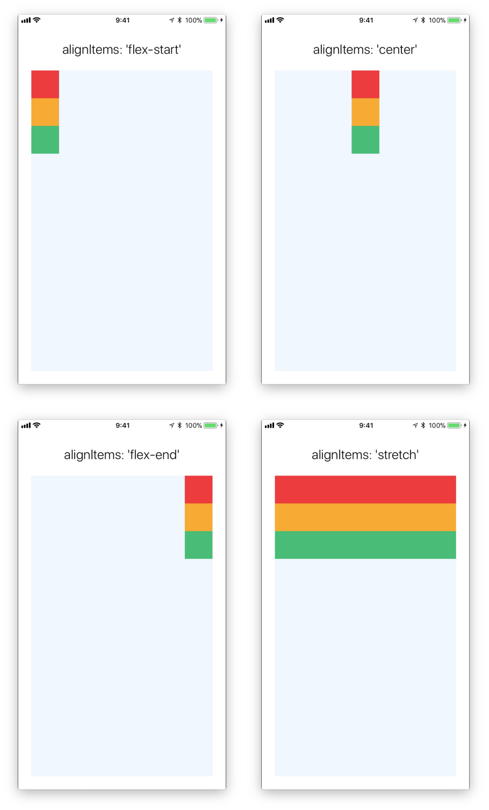
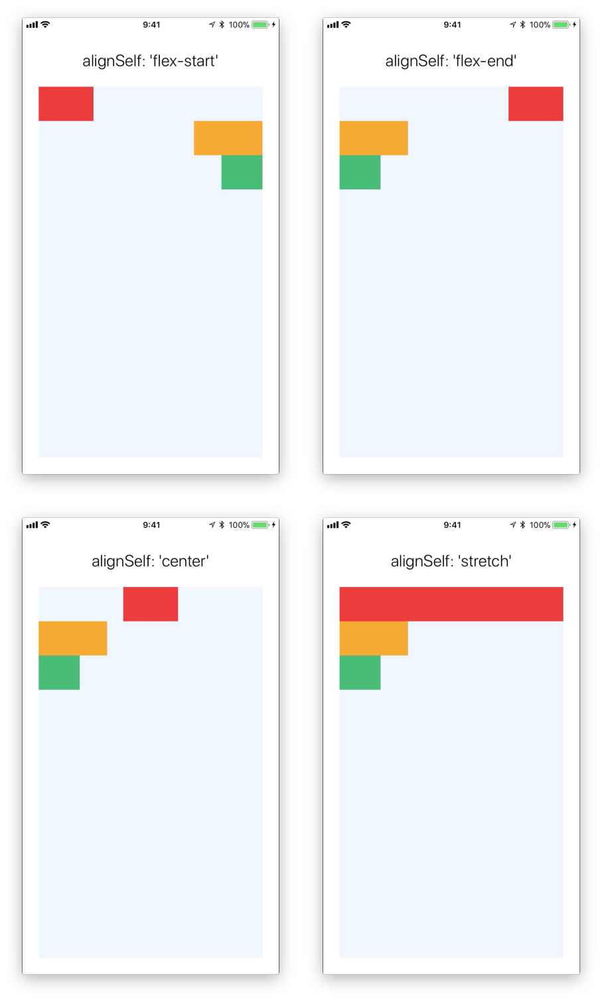
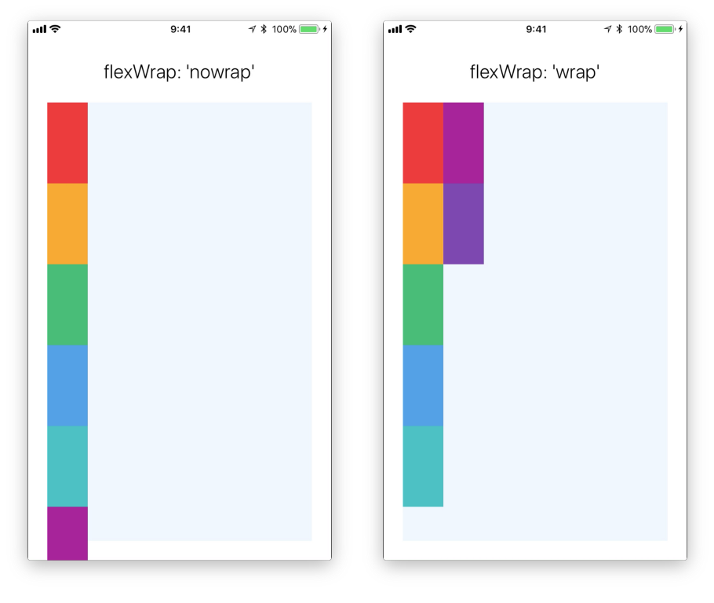
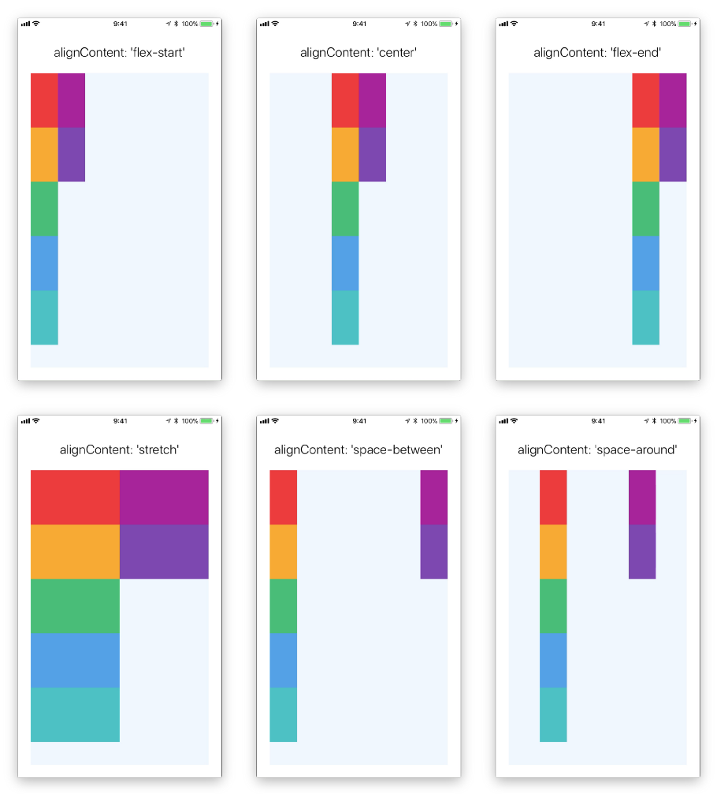
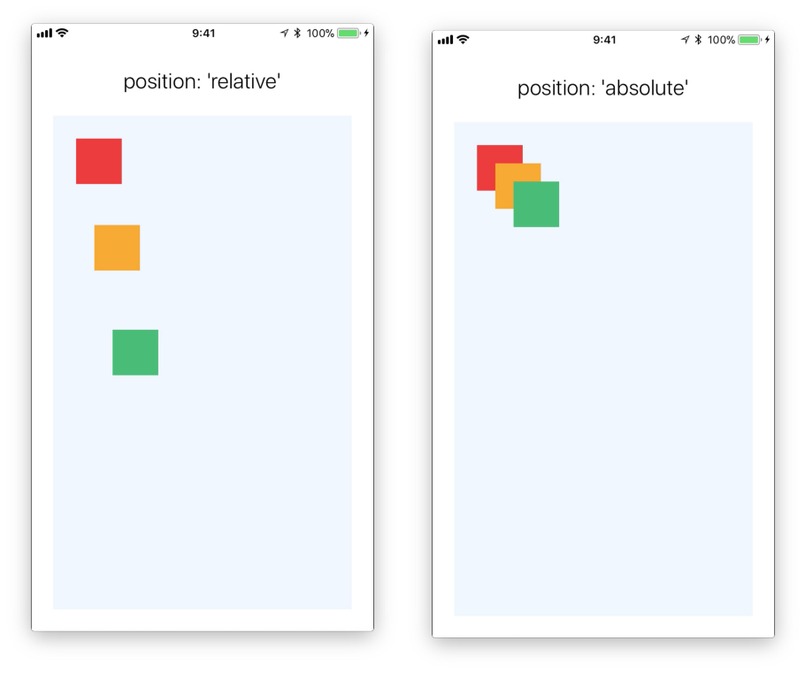

# Flexbox: Dàn Layout với Flexbox

## Flex



- Container View:   flex = 1
  - Rex View:       Flex = **1**
  - Yellow View:    Flex = **2**
  - Green View:     Flex = **3**

> **1+2+3 = 6**
> Rex =         **1/6** of Container Space
> Yellow View = **2/6** of Container Space
> Green View =  **3/6** of Container Space

## flexDirection: Hướng Child

> ‘column’/’column-reverse’/’row’/’row-reverse’

```js
<View style={{flex: 1, flexDirection: 'row'}}>
    <View style={{width: 50, height: 50, backgroundColor: 'red'}} />
    <View style={{width: 50, height: 50, backgroundColor: 'yellow'}} />
    <View style={{width: 50, height: 50, backgroundColor: 'green'}} />
</View>
```



## justifyContent: Phân Bố Child

> flex-start’/’flex-end’/’center’/’space-between’/’space-around’



## alignItems: Canh chỉnh Child

> ‘flex-start’, ‘flex-end’, ‘center’, ‘stretch’
> **‘flex-start’, ‘flex-end’**: Child must set **width**
> **stretch**: child don't set **width**



## alignSelf: Tự canh chỉnh, bỏ qua alignItems cha

> ‘flex-start’, ‘flex-end’, ‘center’, ‘stretch’



## flexWrap: Bọc child

> wrap’, ‘nowrap’



## alignContent: Canh chỉnh Wrap Child

> flex-start’/’center’/’flex-end’/’stretch’/’space-between’/’space-around’
> Container View Phải có: flexWrap:'wrap'



## position: quan hệ các Child

> relative’/’absolute’



---

## References

- <https://facebook.github.io/react-native/docs/flexbox>
- <https://medium.com/wix-engineering/the-full-react-native-layout-cheat-sheet-a4147802405c>
