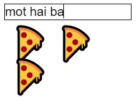

# TextInput: How to save Input Data

## Chú ý

- onChangeText: Save value to State
- value: Display value from State

```js
<TextInput
    //...
    onChangeText={(text) => this.setState({text})}
    value={this.state.text}
/>
```

### Ví dụ



```js
import React, { Component } from 'react';
import { Text, TextInput, View } from 'react-native';

// sentence "Hello there Bob" would be translated as "🍕🍕🍕"
export default class PizzaTranslator extends Component {
  constructor(props) {
    super(props);
    this.state = {text: ''};
  }

  render() {
    return (
      <View style={{padding: 10}}>
        <TextInput
          style={{borderWidth: 1}}
          placeholder="Type here to translate!"
          // Save text change to State
          onChangeText={(text) => this.setState({text})}
          value={this.state.text}
        />
        <Text style={{padding: 10, fontSize: 42}}>
          {this.state.text.split(' ').map((word) => word && '🍕').join(' ')}
        </Text>
      </View>
    );
  }
}
```

---

## Tham Khảo

- <https://facebook.github.io/react-native/docs/handling-text-input>
  